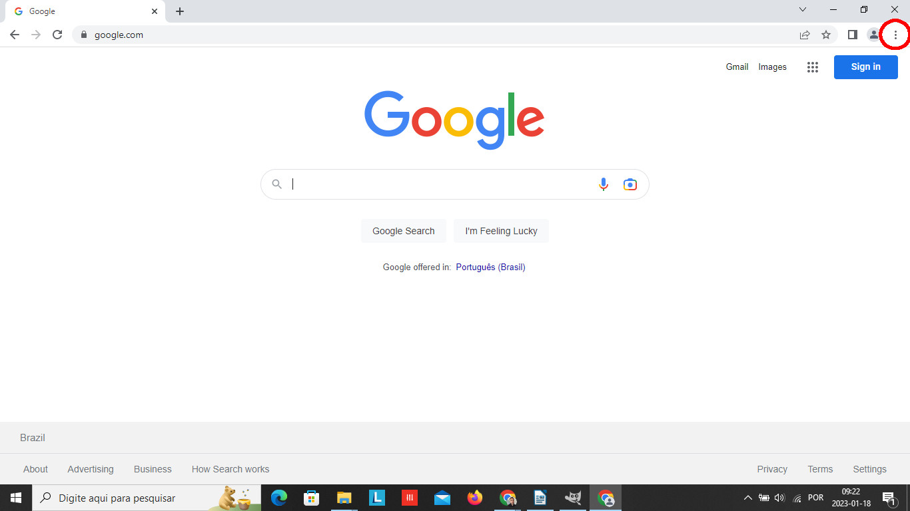
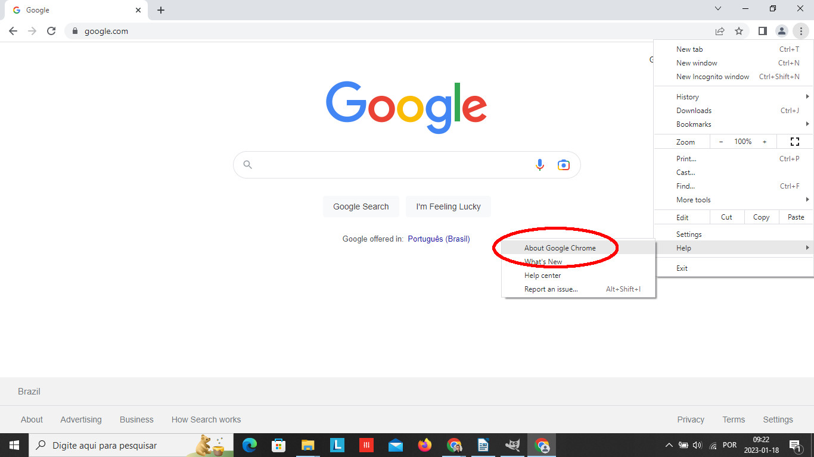
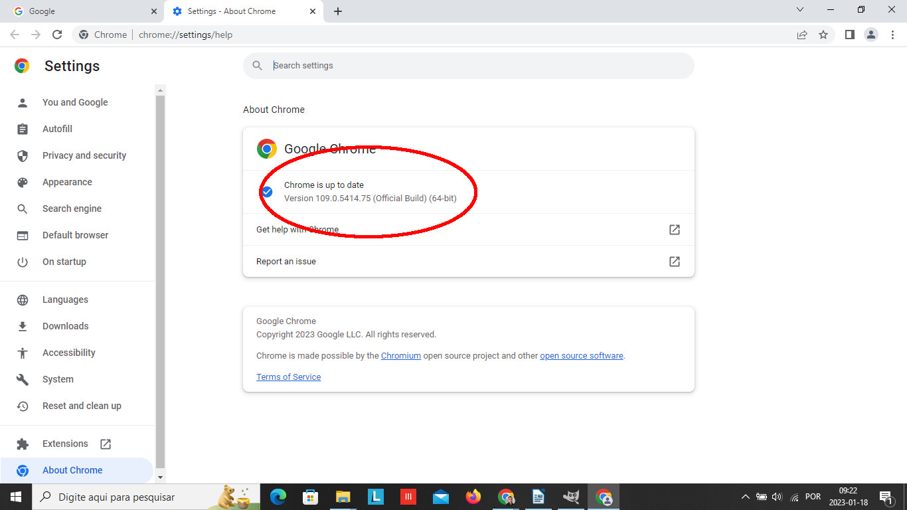

# Spotify Charts Downloader Bot
#### **Description:**
This was my final project for Harvard's course: CS50's Introduction to Programming with Python. In short, it is a web bot to download the weekly top songs charts from [Spotify Charts webpage](https://charts.spotify.com/home). It is the first part of a broader project which intends to analyze the technical features of the most popular songs on Spotify. The main goal on this part is to automate the extraction of the .csv files from the company's database.

#### **Technologies:**
- Python 3.8.1
- Selenium 4.7.2
- Google Chrome 109.0.5414.75
- Chromedriver 109.0.5414.74

#### **Requirements:**
Some requirements must be fulfilled for the program to work. First of all, the [Selenium package](https://www.selenium.dev/) must be installed. This may be achieved by running
```
pip install selenium
```
at the terminal.

Secondly, this program must use a browser to perform its tasks. I chose Google Chrome but it would be possible to use Firefox, Safari, etc. However, if another browser is chosen, the code will not work and it will have to be revised. To download Google Chrome, click [here](https://www.google.com/intl/pt-EN/chrome/browser-tools/).

Thirdly, to control the web browser, the program will need a webdriver. Before download it, you must discover the version number of your web browser. In the case of Google Chrome, click the three dots in the upper-right corner of the window,
<p align="center" width="100%">

</p>
hover your cursor over "Help" and click on "About Google Chrome".
<p align="center" width="100%">

</p>
The version number will be in the center of the screen.
<p align="center" width="100%">

</p>

With the version number, go to [Chromedriver webpage](https://chromedriver.chromium.org/downloads) and choose the right file for your operating system and for your browser version. After that, you must extract the file *chromedriver.exe* to the **drivers** folder within the root directory.

Fourthly, to download the charts from [Spotify Charts webpage](https://charts.spotify.com/home), you must have an accoount on Spotify. To create an account, go to [Spotify Signup](https://www.spotify.com/us/signup). This program will need your **username** and your **password** to log in. These credentails must be in their respective fields in the file [creds.py](./creds.py).


#### **Usage:**
This program is very simple. It only downloads the charts from [Spotify Charts webpage](https://charts.spotify.com/home). When you run it from your coding enviroment, there are two possible outcomes. If you have all the charts available within the `/charts` folder, it will exit with the message: *All charts available are already in the folder*. Otherwise, it will start the webdriver and you'll see the missing charts being donwloaded. This process can take some time. When it finishes, the program will exit with the following message: *All available charts were downloaded*.


#### **Documentation:**
The program is in the file [spotify_downloader_bot.py](./spotify_downloader_bot.py). Besides `main()`, it has six more functions.

##### **main():**

The main function is very brief. Firstly, it checks which files are already within the `/charts` folder - if any chart has already been downloaded, of course. It returns a list with the dates of all missing charts. Secondly, it checks if the length of this list is equal to zero. In this case, all the charts availabe at the webpage were already downloaded and the program simply exits. If it is not the case, it creates a webdriver, logs in to [Spotify Charts webpage](https://charts.spotify.com/home) and starts to download the missing files. Then it exits.

##### **get_missing_charts_dates():** 

This function checks if there is a `/charts` folder in the root directory firstly. If there is not, it creates one.

Secondly, it gets the date of the last Thursday before the day in which the program is running. The reason is related to Spotify's naming files pattern. Weekly charts are published every Friday but they have the Thursday's date in their names. Getting the last thursday date is important to discover all the charts' names.

Thirdly, it uses the last Thursday date to get the dates of all Thursdays to December 29, 2016. This is the date of the first chart available on [Spotify Charts webpage](https://charts.spotify.com/home). It stores these Thursdays' dates in a list called `all_dates`.

Fourthly, it gets the names of the files within the `/charts` folder. If there is any file there, its name will be something like *regional-global-weekly-2017-03-09.csv*. The function extracts the dates from these names and returns them in a list called `files_dates`.

Finally, this function compares `files_dates` list  with `all_dates` list. It removes from the latter the dates of the charts that have already been downloaded and returns a third list with all the missing charts dates.

##### **create_webdriver():**

This function creates the webdriver to access [Spotify Charts webpage](https://charts.spotify.com/home). Firstly, it sets the `/charts` folder as the download default directory for the webdriver. Secondly, it creates the webdriver by passing the path to the *chromedriver.exe* file (`./drivers/chromedriver.exe`). Finally, the function returns the webdriver as a variable called `driver`.

##### **checking_cookie_dialog(driver):**
The first version of this script did not have this function. There was no cookies dialog box in Spotify Charts' Webpage. It is used inside other functions to check if the dialog box appears and to click on its close button. Unfortunately it is not working very well and sometimes it raises an error. I will address ths issue in the next update.

##### **login(driver):**

This function takes the `driver` variable as an argument and goes to the log in page of [Spotify Charts webpage](https://charts.spotify.com/home). Then it fills the form with the `USERNAME` and the `PASSWORD` from [creds.py](./creds.py) and click on the login button. It returns the webdriver as a variable called `driver_logged`.

##### **download_missing_charts(driver_logged, missing_charts_dates):**

This function takes the `driver_logged` variable and the `missing_charts_dates` as arguments. It starts a loop while the length of `missing_charts_dates` is great than 0. It creates an URL with the first date of the list, passes to the `get` method of the `driver_logged` and calls the function `download_chart()`.

##### **download_chart(driver_logged, missing_charts_dates):**

This function firstly finds and clicks on the button to download the chart. With the first date of the `missing_charts_dates` list, it creates the name of the file in accordance to Spotify's pattern and checks if the file is already in the `charts` folder. The goal of this part of the code is to wait for the download to be completed before closing the webdriver and exiting the program. Lastly, the function removes the first date of `missing_charts_dates` list.